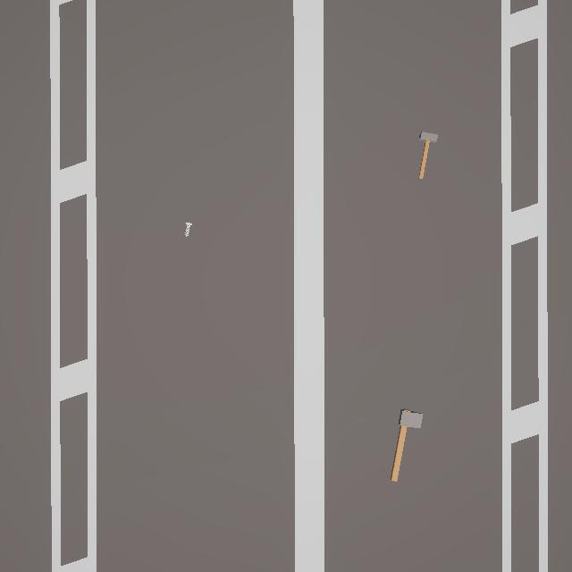

# F.O.D. Hunter

**Edge-AI foreign object debris detection for flight decks.**

<p>
  
  
  
  
  
  
</p>

Foreign object debris (FOD), such as a dropped tool or a loose bolt, can destroy a jet engine. Today, sailors find it with a slow, manual walk-down of the whole deck. F.O.D. Hunter puts a drone over the deck instead. A YOLOv8 model spots debris in the live camera feed, operators steer the drone and log finds by voice, and deck workers get a task list of what to clear.

<p align="center"></p>

## How it works

```text
 Unity drone sim ──frames──►  .NET 9 vision server  ──MJPEG /stream──►  React operator console
        ▲                      YOLOv8n → ONNX Runtime                      ├─ live feed + detections
        └──── /drone/command ◄── NMS, conf > 0.80   ◄── /drone/move ───────┤  drone controls
                                  deck log (/commit)                       └─ push-to-talk (Whisper)
                                        │
                                        └──/deck-logs, /resolve/{id}──►  React worker view (clear tasks)

 FastAPI + faster-whisper (large-v3, CUDA fp16) ◄── /whisper audio proxy
```

| Component | Path | Stack |
|---|---|---|
| Vision + API server | `DotNetServer/src/FodHunter.Vision` | .NET 9 minimal API, ONNX Runtime, custom NMS |
| Operator & worker UI | `FodHunter.Web` | React 19, Vite, React Router |
| Voice transcription | `whisper_server.py` | FastAPI, faster-whisper large-v3 on GPU |
| Model training | `YoloTraining` | Ultralytics YOLOv8n, 1 class (`FOD`), exported to ONNX |

## Running it locally

```bash
# 1. Voice server (NVIDIA GPU recommended)
pip install -r requirements.txt
python whisper_server.py                 # :8000

# 2. Vision server
cd DotNetServer/src/FodHunter.Vision
dotnet run                               # :5000, loads best.onnx

# 3. Web consoles
cd FodHunter.Web && npm install && npm run dev   # :5173  (/ = operator, /worker = deck crew)
```

The Unity drone simulator posts frames to `POST /` and polls `GET /drone/command`.

**Retrain the detector:** point `YoloTraining/fod_config.yaml` at your dataset, then run `python YoloTraining/train_fod.py`. It trains for 30 epochs at 640px and exports `best.onnx`.

## Team

Built by a California Baptist University team (Brandon Magana, Eli Manning, Dariel Rodriguez, Ryan Stoffel).
